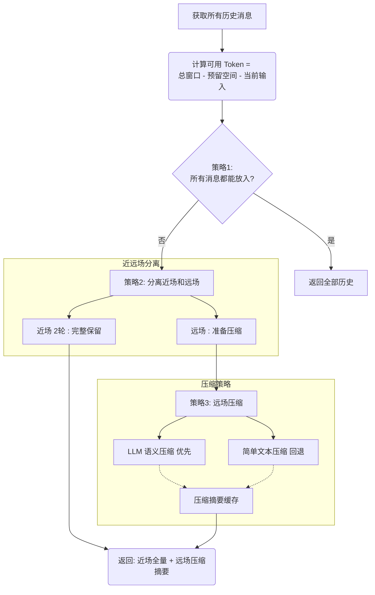

## 🌟 核心特性 / Key Features

### 1. 动态 Token 窗口管理 (Dynamic Token Window)

不再依赖不稳定的“固定轮数”策略，而是基于模型 Context Window 进行实时精算：

* **实时配额监控：** 每一轮对话前自动计算已用 Token 和剩余空间。
* **锚点保护 (Anchor Protection)：** 强制固定 `System Prompt`，确保 Agent 的核心指令在任何极端情况下都不会被挤出上下文。

### 2. 差异化留存策略 (Tiered Retention)

针对 RAG 场景设计了非对称的记忆留存逻辑：

* **近场全量 (Full-Text)：** 仅保留最近 2 轮对话的原始文本，维持即时的对话语气与流畅度。
* **远场压缩 (Summary)：** 2 轮之前的历史记录自动触发 **Summary 压缩**，将冗长的对话转为精炼的语义线索。

### 3. 检索轨迹清理 (Retrieval Trace Cleaning)

专门针对工具返回的“脏数据”进行处理：

* **噪声过滤：** 自动识别并剔除工具返回的原始调试日志、冗余错误信息（如 "Information not found"）。
* **语义蒸馏：** 对检索到的 MD 文档片段进行去冗余处理，只向模型输送最核心的知识点，防止上下文污染。

---

## 🛠️ 记忆结构示例 / Memory Structure

处理后的上下文构建逻辑如下：

| 层次 | 处理方式 | 包含内容 |
| --- | --- | --- |
| **System 层** | **永久保留** | 核心角色设定、任务指令、操作约束 |
| **远场记忆** | **语义摘要** | 前序轮次的任务目标、已确认的事实结论 |
| **近场记忆** | **完整文本** | 用户最近的提问、Agent 最近的详细回答 |
| **工具缓存** | **精简注入** | 经过清洗后的 MD 分块、必要的元数据路径 |

---
这张流程图展示了当 Agent 的历史记忆（Context）超过一定长度，被判定为“远场消息（Distant Field）”时，系统是如何处理这些旧数据的。

这是一个典型的**容错设计（Fallback Mechanism）**，目的是在保证系统稳定性的前提下，尽可能保留高质量的记忆。

以下是该策略的具体拆解：

### 1. 核心逻辑：双路径处理

系统在处理压缩时，设计了两条路：一条是“聪明的高级路”，一条是“保底的笨拙路”。

#### 🅰️ 优先路径：LLM 语义压缩 (Semantic Compression)

这是系统默认的首选方案。

* **原理**：调用一个 LLM（通常是成本较低的模型，如 GPT-3.5-Turbo 或专门的 Summarizer 模型），把一大段旧对话扔给它，让它总结成一段精简的摘要。
* **优点**：
* **保留逻辑**：它能理解上下文。比如用户说了“我不要红色的，要蓝色的”，LLM 会总结为“用户偏好蓝色”，而不是机械地截断文字。
* **信息密度高**：能把 1000 个 Token 的废话压缩成 50 个 Token 的干货。

* **缺点**：需要消耗 Token 成本，且依赖网络 API，有可能会调用超时或失败。

#### 🅱️ 回退路径：简单文本压缩 (Simple Text Compression)

这是备用方案（Plan B）。只有当上面的 LLM 路径走不通（比如 API 报错、网络断连、或者 Token 余额不足）时，才会触发这条路。

* **原理**：使用传统的编程逻辑处理字符串。
* **截断 (Truncation)**：直接保留前 500 字，后面的扔掉。
* **去噪**：过滤掉停用词（的、了、吗）或非关键符号。
* **滑动窗口**：只保留每轮对话的首尾句。
* 
* **优点**：速度极快（毫秒级），不需要联网，**绝对不会报错**。
* **缺点**：非常生硬，容易把关键信息切断（比如把 API Key 切了一半），导致记忆丢失。

---

### 2. 举个生动的例子

假设用户在很久之前发了一段很长的话：

> “你好，我叫小明，我是一名程序员，我最近在学习 Python，我想让你帮我写一个贪吃蛇游戏，界面要黑色的，速度要中等...”

**路径 A (LLM 压缩) 的结果：**

> “用户叫小明，是程序员，请求用 Python 写黑色界面的贪吃蛇游戏。”
> *(完美保留了关键意图)*

**路径 B (简单压缩 - 暴力截断) 的结果：**

> “你好，我叫小明，我是一名程序员，我最近在学习 Python，我想让你帮...”
> *(丢失了“写贪吃蛇游戏”这个关键请求)*

### 总结

这个策略的精髓在于**“优先追求质量，但必须保证可用性”**。它防止了因为 LLM 服务波动导致整个 Agent 崩溃（Crash），同时也利用缓存避免了重复计算。

